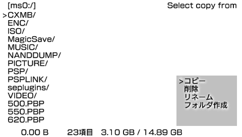

MStoMS
----

このアプリはファイルをメモリスティックからメモリスティックにコピーできます。  
突然ファイルが消えても自己責任でお願いします。  
PSP1000やOFWより、2000以降のCFW、LCFWほうが早くコピーができます  
1000やOFWだと1回あたり23MB、2000以降のCFW、LCFWだと1回あたり50MBコピーできます。

### 更新内容
* 1.1
    * intraFontをやめてlibmenuを使うようにした。
    * メモステの入れ替えが少なくなるようにした。
    * 一度に複数コピーできるようにした。
    * 英語版だと×と○が入れ替わるようにした。
    * バグ修正や細かい調整などした。

### ダウンロード
[MStoMS1.1.zip](https://www.dropbox.com/sh/bc3hz5qsh2mch06/AADtVKATBkAZvwGYRQ4SOuj7a/MStoMS1.1.zip?dl=0)

### スクリーンショット

