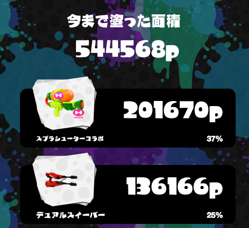

Ika-Ring-Extender
----

イカリングの表示内容を拡張します。
現在以下の機能があります。

* プロフィール
    * 塗った面積の合計表示
    * 各武器の名前表示
    * 各武器の塗り率表示

* スケジュール
    * 情報を表形式で表示

### スクリーンショット

### 更新内容
* 0.8(2015/11/13)
    * メンテ中に書換えないように変更

* 0.7(2015/11/01)
    * フェス時にステージ情報の表示を変更してしまう問題を修正

* 0.6(2015/08/23)
    * スケジュールが表にならないバグを修正

* 0.5(2015/08/22)
    * fes時にスケジュールを書き換えないようにした
    * 表のレイアウトを調整

* 0.4(2015/08/17)
    * スケジュールを表形式で表示するようにした

* 0.3(2015/08/13)
    * 現在使っているブキの名前も表示するようにした

* 0.2(2015/08/13)
    * 表示されないことがあるバグを修正

* 0.1(2015/08/13)
    * first release

### ダウンロード
[Ika-Ring-Extender.user.js](https://github.com/ABCanG/IkaRingExtender/raw/master/Ika-Ring-Extender.user.js)

### Github
[https://github.com/ABCanG/IkaRingExtender](https://github.com/ABCanG/IkaRingExtender)
